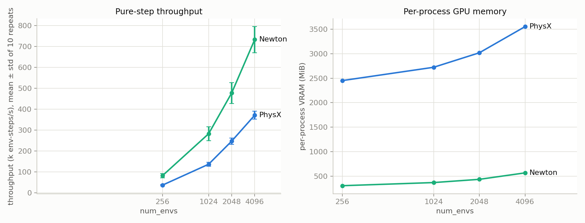
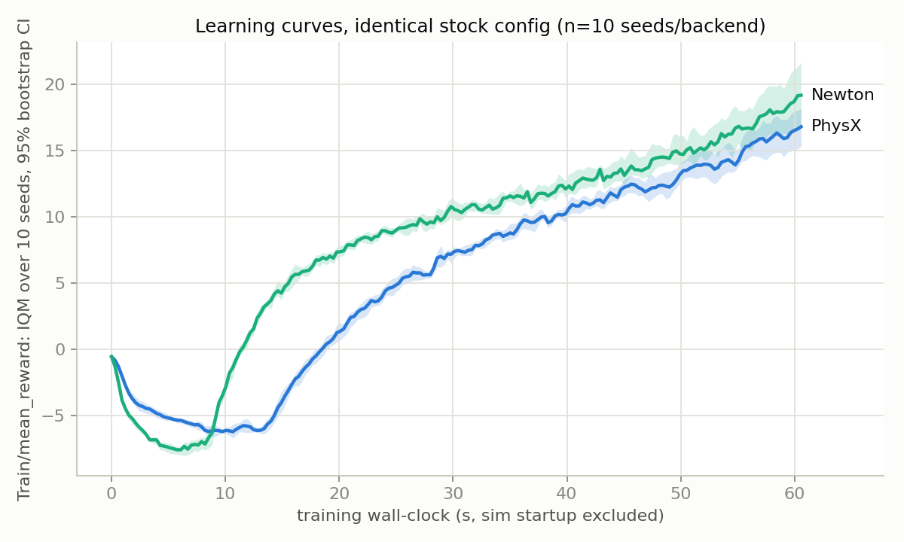
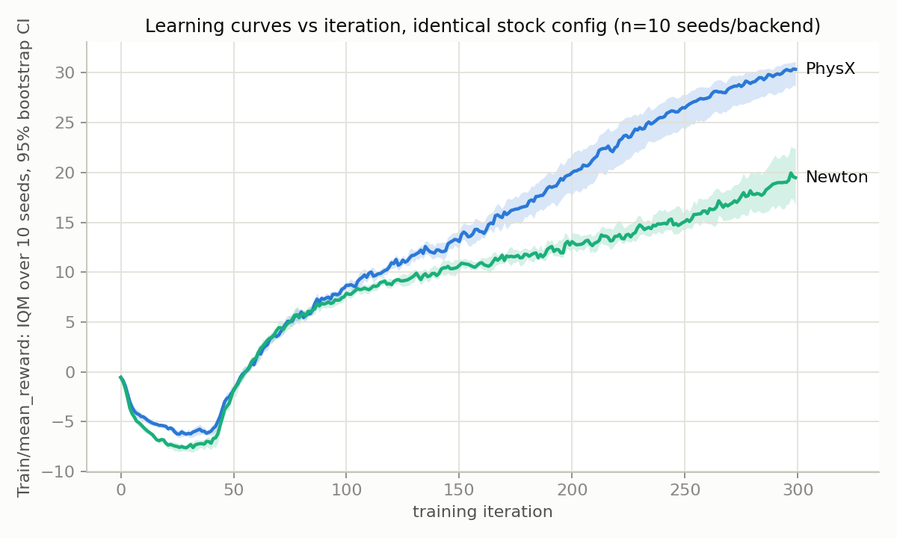

# PhysX vs Newton (MuJoCo-Warp) in Isaac Lab 3.0: an end-to-end comparison

Controlled comparison of the **PhysX** solver vs Newton's **MuJoCo-Warp** solver on
the identical stock flat-terrain quadruped velocity-tracking task
(`Isaac-Velocity-Flat-Unitree-Go2-v0`). Only the physics backend changes; the
resolved config is dumped to disk for every run and diffed: only the
physics-manager block differs between arms.

Measurement dates: 2026-06-13 (pilot, dynamics probe) and 2026-07-02
(strengthened suite reported here). A 3-seed pilot preceded this; everything
below supersedes it with 10 timed probe repeats per point and n=10 training
seeds per backend.

---

## Environment

| Item | Value |
|---|---|
| Isaac Lab | **3.0.0** (git `a4a7602f`) |
| Newton / Warp / mujoco-warp | **1.0.0** / **1.12.0** / **3.5.0.2** |
| rsl-rl-lib / torch | 5.0.1 / 2.10.0+cu128 |
| GPU | one consumer Blackwell-architecture NVIDIA GPU |
| Driver / CUDA | 570.211.01 / 12.8 |
| Full capture | [`results/strengthen/env_capture.txt`](results/strengthen/env_capture.txt) (pip freeze, SHAs) |

**Backend selection.** Isaac Lab 3.0 selects the physics backend with the Hydra
`presets=` override (`presets=physx` / `presets=newton`). The task ships both arms
in a single `PhysicsCfg(PresetCfg)`:

```python
class PhysicsCfg(PresetCfg):
    default = PhysxCfg(gpu_max_rigid_patch_count=10 * 2**15)
    newton  = NewtonCfg(solver_cfg=MJWarpSolverCfg(
                  njmax=65, nconmax=35, cone="pyramidal",
                  impratio=1, integrator="implicitfast"),
              num_substeps=1, debug_mode=False)
    physx = default
```

The preset swaps **only** the physics manager. Robot, rewards, observations,
events, `sim.dt = 0.005`, `decimation = 4`, and the full rsl_rl/PPO config are
shared. **Both backends integrate one physics step per `sim.dt` at 200 Hz**
(Newton `num_substeps: 1`; PhysX has no substep multiplier in this config, only
solver iteration counts): the resolved per-run configs for one run of each
backend are committed under
[`results/strengthen/params/`](results/strengthen/params/), and the two
`agent.yaml` files are identical up to `run_name`. Newton solver params are the
stock shipped values: **deliberately not retuned**; this is a stock-vs-stock
comparison, and that includes each backend's stock memory sizing (see the VRAM
caveat below).

> Operational note: Kit captures the process stdout fd, so post-init `print()`
> is swallowed. All metrics are read from on-disk artifacts (tensorboard event
> files, JSON), never stdout.

---

## 1. Pure-step throughput and per-process VRAM vs `num_envs`

Zero-action stepping, 10 warmup steps excluded, then **10 independently timed
blocks of 100 steps** per point (`scripts/probe_sweep.py`); VRAM is per-PID
(`nvidia-smi --query-compute-apps`), not whole-GPU. Raw:
`results/strengthen/probe_*.json`.

| num_envs | PhysX steps/s | Newton steps/s | ratio | PhysX VRAM (MiB) | Newton VRAM (MiB) |
|---|---|---|---|---|---|
| 256  | 36,877 ± 2,829   | 82,281 ± 10,609  | 2.23x | 2451 | 304 |
| 1024 | 136,708 ± 9,811  | 282,463 ± 33,819 | 2.07x | 2723 | 368 |
| 2048 | 247,140 ± 14,538 | 477,471 ± 49,831 | 1.93x | 3019 | 434 |
| 4096 | 371,229 ± 18,567 | 732,796 ± 62,073 | 1.97x | 3553 | 566 |



- Newton holds a ~2x stepping advantage across the whole sweep on this GPU.
- **What "zero-action" means here:** the task's action term offsets the *default
  joint positions*, so zero action = the DCMotor PD holding the default standing
  pose. The probe steps a standing robot (~4 foot contacts per env, far from
  `nconmax=35` saturation), not a collapsed one.
- **Known artifact, kept in the statistics:** all envs start together, so the
  synchronized 1000-step episode-timeout reset lands in the **last** timed block
  for both backends (visible as a ~15–25% dip in the final repeat in the raw
  JSONs). It hits both backends equally and is included in the mean ± std. The
  *first* block shows no JIT slowdown: warmup was sufficient (Newton's first
  block is its fastest).
- **VRAM caveat: this is stock-config footprint, not engine-inherent
  efficiency.** The stock PhysX arm pre-allocates a large GPU buffer pool
  (`gpu_max_rigid_patch_count = 10 * 2**15`), while the stock Newton arm sizes
  tight per-env contact/constraint buffers (`njmax=65, nconmax=35`). The
  measured footprints are real and are what a stock-config user experiences, but
  a tuned-buffer comparison would narrow the gap; don't quote the ratio as an
  intrinsic engine property.
- An earlier single-shot probe (n=1) read 2.23x at 2048 envs; with 10 repeats the
  mean is 1.93x. Point estimates from single probes are noisy at the ±10% level -
  hence the repeats.

## 2. End-to-end training (n=10 seeds per backend)

2048 envs, 300 iterations, identical stock PPO. Manifest:
`results/strengthen/manifest10.csv`; per-iteration extract:
`results/strengthen/results10.csv`. All 20 runs exited 0.

| metric | PhysX | Newton |
|---|---|---|
| training fps, IQM [95% CI] | 147,155 [145,943, 148,544] | 241,070 [240,527, 242,441] |
| training fps, mean ± std over seeds | 147,187 ± 2,203 | 241,608 ± 2,195 |
| total wall per run, mean ± std (s) | 115.7 ± 1.8 | 79.3 ± 0.4 |
| per-process VRAM peak, mean (MiB) | 3247 | 617 |
| final reward @300 iters, IQM [95% CI] | 30.36 [28.71, 31.09] | 19.48 [16.77, 22.36] |
| final reward @300 iters, mean ± std | 29.78 ± 2.65 | 19.63 ± 3.45 |

(IQM + 95% stratified-bootstrap CIs per rliable/Agarwal et al. 2021, which
targets exactly this few-run regime; plain mean ± std given alongside so
nothing hides in the aggregator choice.)

End-to-end training throughput advantage is **1.64x**: smaller than the ~2x
pure-stepping gap because the learning side (PPO update, logging) is
backend-independent. Quote whichever matches your workload; both are real.

## 3. Learning parity: both views, because they disagree




- **Vs wall-clock** (first figure): at every equal time budget within Newton's
  61 s training window, Newton's IQM reward is ahead: cheaper iterations
  compound.
- **Vs iteration** (second figure): the curves track each other for ~90
  iterations, then diverge; PhysX converges to a clearly higher reward on this
  asset (non-overlapping CIs at iteration 300).
- Interpretation: this is an **out-of-box-swap effect on a PhysX-tuned asset**,
  not a quality verdict. Section 4 shows the two backends genuinely integrate
  different dynamics, so the two policy populations optimize different reward
  landscapes. A fair asymptotic-quality comparison would need per-backend tuning
  (and ultimately transfer evaluation), both out of scope.

## 4. Open-loop dynamics-equivalence probe

Same asset, `num_envs=1`, all randomization off, `base_contact` termination off,
identical initial state, identical open-loop action tape (50-step zero-hold, then
per-joint sinusoids; 6.0 s), actions remapped to canonical joint order per
backend. Scripts: `record_dynamics.py`, `compare_dynamics.py`. Raw:
`results/pillar1/`.

- **Both backends replayed deterministically across our repeats** (two
  recordings per backend): same-backend divergence is exactly 0.0 m / 0.0 rad,
  so within this experiment all cross-backend divergence is attributable to the
  backend, not RNG or the harness.
- **Cross-backend divergence is large and partly systematic:** base position
  diverges to 0.41 m and orientation to 25° over 6 s (5 cm crossed at 1.72 s);
  mean joint RMSE 0.176 rad. During the initial 1 s zero-action hold, joints
  already disagree by 0.118 rad: a systematic PD-hold difference before any
  contact-driven amplification. Foot-contact force correlation is weak (r≈0.39
  overall).
- **Footgun 1: joint and body ordering differ.** PhysX enumerates
  joint-type-major (`FL_hip, FR_hip, RL_hip, …`), Newton leg-major
  (`FL_hip, FL_thigh, FL_calf, …`) on the same asset. Feeding one backend's
  action vector to the other without remapping silently commands different
  joints. The harness remaps to a canonical order everywhere.
- **Footgun 2: joint-drive gain representation differs at the data level, but
  effective PD is identical.** With the Go2's `DCMotorCfg(stiffness=25,
  damping=0.5)` (explicit Python-side PD applied as effort), the PhysX data path
  reports physics-level joint stiffness/damping 0/0, while Newton reports
  25/0.5. Traced through Isaac Lab and MJWarp source and confirmed on the live
  model (`scripts/check_effort_mode.py`,
  `results/strengthen/effort_mode_check.json`): **`mjw_model.nu == 0`**: all 12
  joints import as effort-mode, MJWarp builds zero PD actuators, and the echoed
  gains are never consumed. The comparison here is therefore a true
  single-PD-vs-single-PD comparison. The underlying write-order defect in Isaac
  Lab's Newton articulation path (which turns into genuine double-PD for assets
  whose USD authors nonzero drive gains) is tracked upstream in
  isaac-sim/IsaacLab#5806; our trace and live measurement are posted there.

Consequence for RL: the reward gap in section 3 is expected: policies trained
under one backend experience materially different contact dynamics than the
other. Cross-backend (and sim-to-real) transfer cannot be assumed without
re-validation.

## Caveats

- Single task (Go2 flat velocity), single robot, single GPU.
- Stock solver settings both sides; no per-backend tuning attempted.
- Throughput probe uses zero actions (policy-driven stepping can differ).
- Dynamics probe: one action tape, one dt/decimation; late-time divergence mixes
  the systematic difference with deterministic sensitive-dependence amplification
  through contact: the clean systematic signal is the 0.118 rad settle-phase
  number.
- The Newton backend in Isaac Lab 3.0 is experimental; numbers will move as it
  matures.
- **No sim-to-real claims.** Which backend's policies transfer better to a real
  robot is the decision-relevant question and is not answered here.
